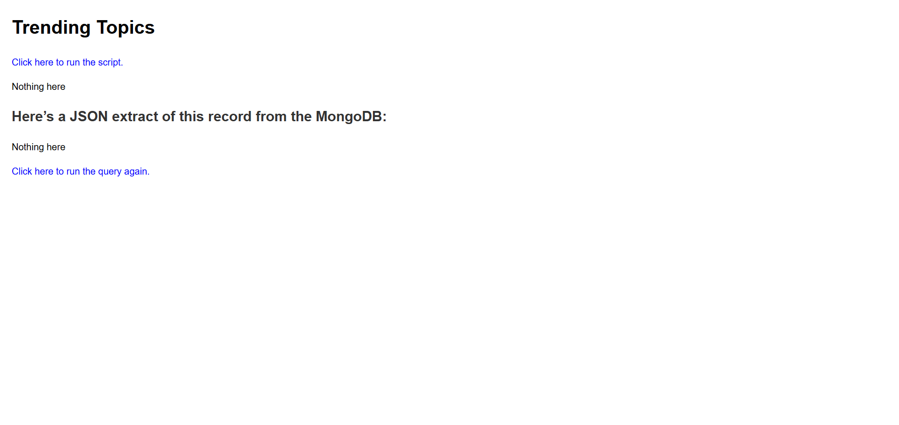
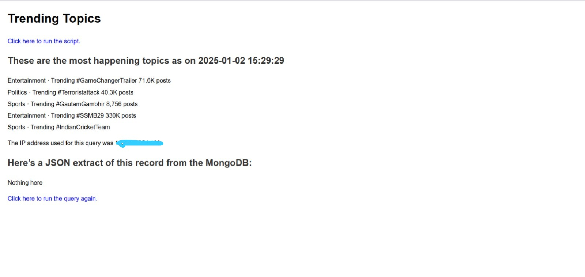
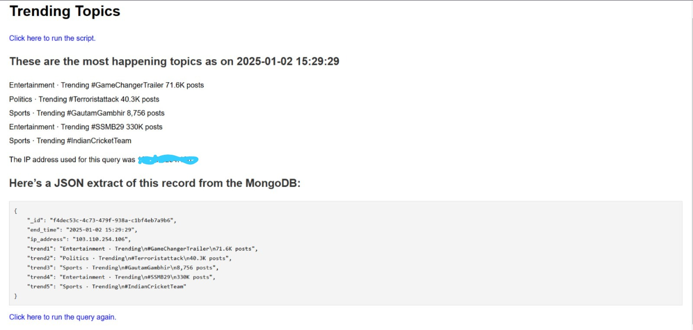

# Project Name: Twitter Trends Fetcher

## Overview

This project fetches the current trending topics from Twitter, uses a working proxy to avoid network restrictions, and stores the data into a MongoDB database for future analysis.

## Outputs

### Output 1: Trending Topics Screenshot

### Output 2: Trends Visualization

### Output 2: Trends Visualization form Mongo

## Setup

Follow the setup instructions below to get started.
